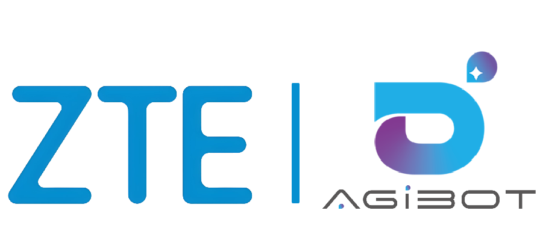
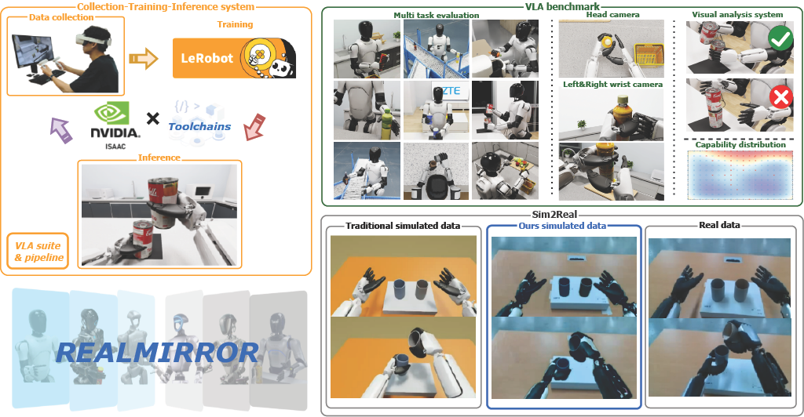

<div align="center">
  
</div>



<div align="center">
  <a href="https://terminators2025.github.io/RealMirror.github.io/">
    
  </a>
</div>

# *Opensource Plan
**Before October 15, 2025**
 - [x] Inference code
 - [x] Evaluation code
 - [x] Agibot A2 robot model
 - [x] Scene assets
 - [x] Checkpoints

**Before October 30, 2025**
 - [x] Training code
 - [] Datasets
 - [x] Data collection
 - [x] Teleoperation
 - [x] Toolchains

# 1. Overview
The emerging field of Vision-Language-Action (VLA) for humanoid robots faces several fundamental challenges, including the high cost of data acquisition, the lack of a standardized benchmark, and the significant gap between simulation and the real world. To overcome these obstacles, we propose RealMirror, a comprehensive, open-source embodied AI VLA platform. RealMirror builds an efficient, low-cost data collection, model training, and inference system that enables end-to-end VLA research without requiring a real robot. To facilitate model evolution and fair comparison, we also introduce a dedicated VLA benchmark for humanoid robots, featuring multiple scenarios, extensive trajectories, and various VLA models. Furthermore, by integrating generative models and 3D Gaussian Splatting to reconstruct realistic environments and robot models, we successfully demonstrate zero-shot Sim2Real transfer, where models trained exclusively on simulation data can perform tasks on a real robot seamlessly, without any fine-tuning. In conclusion, with the unification of these critical components, RealMirror provides a robust framework that significantly accelerates the development of VLA models for humanoid robots.

# 2. Quick Start

### 2.1 Requirements

| Tested |
| :----|
| <ul><li>Ubuntu 22.04</li><li>NVIDIA Isaac Sim 5.0.0</li><li>Hardware<ul><li>GPU: GeForce RTX 5090/5880</li><li>Driver:575.64.03 + CUDA 12.9</li></ul></li></ul> |

### 2.2 Prepare Benchmark Data

To get started with the RealMirror benchmark, you need to download the pre-collected dataset and trained models:

1. **Download the Data**
   - Access the benchmark data from our Google Drive: [RealMirror Benchmark Data](https://drive.google.com/drive/folders/1A_4cs21x-W4V9r7zRgsiLGJGBPsRRveF?usp=drive_link)
   - The dataset includes both simulation assets and pre-trained models for all benchmark tasks
   - Total download size: approximately 13 GB

2. **Extract and Setup**
   - After downloading, extract the compressed archive to your local directory
   - We recommend extracting to a dedicated folder, for example: `~/RealMirror_Benchmark_data/`
   - Ensure the extracted directory structure matches the following organization:

- **Data Structure**

```
RealMirror_Benchmark_data
├── assets
│   ├── robot
│   │   └── AgiBotA2
│   └── scenes
│       ├── Task1_Kitchen_Cleanup
│       ├── Task2_Cup_to_Cup_Transfer
│       ├── Task3_Assembly_Line_Sorting
│       ├── Task4_Can_Stacking
│       └── Task5_Air_Fryer_Manipulation
└── models
    ├── Task1_Kitchen_Cleanup
    │   ├── ACT
    │   ├── Diffusion
    │   └── SmolVLA
    ├── Task2_Cup_to_Cup_Transfer
    │   ├── ACT
    │   ├── Diffusion
    │   └── SmolVLA
    ├── Task3_Assembly_Line_Sorting
    │   ├── ACT
    │   ├── Diffusion
    │   └── SmolVLA
    ├── Task4_Can_Stacking
    │   ├── ACT
    │   ├── Diffusion
    │   └── SmolVLA
    └── Task5_Air_Fryer_Manipulation
        ├── ACT
        ├── Diffusion
        └── SmolVLA
```

### 2.3 Installation

1. Donwload RealMirror source code:
```bash
git clone https://github.com/terminators2025/RealMirror.git
cd RealMirror
```
2. Fetch lerobot by git submodule command:
```bash
git submodule init
git submodule update
cd thirdparty/lerobot

# Checkout and apply patch of lerobot
git checkout fe88c5942cce222c5463350d999a463b9016cf8c
git apply ../../patches/lerobot_customizations.patch
```
3. Install LeRobot in editable mode into Isaac Sim's Python environment
```bash
$isaac_sim_dir/python.sh -m pip install -e .
```
4.  Install RealMirror in editable mode into Isaac Sim's Python site-packages library
```bash
#Install RealMirror To Issac Sim's python Site lib
$isaac_sim_dir/python.sh -m pip install -e .
```

### 2.4 Usage

### 2.4 Benchmark Tasks

#### 2.4.1 Benchmark Task Config
The benchmark configuration is defined in a JSON file, such as `Task1_Kitchen_Cleanup.json`. This file specifies all the necessary parameters for the robot, scene, and evaluation.


The following task names are supported

<table>
  <tr>
    <th colspan="2"><strong>Task Name</strong></th>
  </tr>
  <tr>
    <td>Task1_Kitchen_Cleanup</td>
    <td>Task2_Cup_to_Cup_Transfer</td>
  </tr>
    <td>Task3_Assembly_Line_Sorting</td>
    <td>Task4_Can_Stacking</td>
  <tr>
  </tr>
    <tr>
    <td>Task5_Air_Fryer_Manipulation</td>
  </tr>
</table>

- **`robot`**: This section defines the robot to be used in the task.
  - `robot_type`: Specifies the type of robot (e.g., "A2").
  - `robot_cfg`: Points to the robot's specific configuration file (e.g., "a2_robot_config.json").

- **`scene`**: This is an array that contains the settings for the simulation scene.
  - `task_related_objects`: An array of objects that are relevant to the task. Each object includes:
    - `name`: A unique identifier for the object.
    - `description`: A natural language instruction describing the task goal for this object.
    - `cylinder_prim_path`: The path to the object's primitive in the USD scene.
    - `target_prim_path`: The path to the target location where the object should be placed.
  - `scene_id`: A unique identifier for the scene.
  - `scene_usd`: The absolute path to the USD file that defines the scene layout.
  - `prime_path`: The base path for all primitives within the scene.
  - `camera_configs`: Defines the properties for each camera used in the simulation, including:
    - `head_camera`, `left_wrist_camera`, `right_wrist_camera`: Each camera has settings for name, path, image resolution (`height`, `width`), and other camera-specific parameters.
  - `eval_cfg`: Contains configuration for the evaluation process.
    - `model`: Specifies the paths for the pre-trained models.
      - `model_root_dir`: The root directory where all models are stored.
      - `checkpoints_dir`: Subdirectories for different model architectures like ACT, Diffusion, and SmolVLA.

##### Important Path Configuration

After extracting the benchmark data, you need to update the configuration files to point to the correct paths on your system:

**1. Robot Configuration (`comm_config/configs/a2_robot_config.json`)**

Update the following paths to match your extracted benchmark data location:

```json
{
    "usd_path": "/path/to/your/RealMirror_Benchmark_data/assets/robot/AgiBotA2/model_no_col2.usd",
    "urdf_path": "/path/to/your/RealMirror_Benchmark_data/assets/robot/AgiBotA2/model_no_col2.usd",
    "robot_descriptor_paths": {
        "right": "/path/to/your/RealMirror_Benchmark_data/assets/robot/AgiBotA2/arm_descriptor/a2_right_arm_robot_descriptor.yaml",
        "left": "/path/to/your/RealMirror_Benchmark_data/assets/robot/AgiBotA2/arm_descriptor/a2_left_arm_robot_descriptor.yaml"
    }
}
```

**2. Task Configuration Files (`tasks/Task*.json`)**

For each task configuration file (Task1_Kitchen_Cleanup.json, Task2_Cup_to_Cup_Transfer.json, etc.), update:

- **Scene USD path**: Point to the corresponding scene asset
  ```json
  "scene_usd": "/path/to/your/RealMirror_Benchmark_data/assets/scenes/Task1_Kitchen_Cleanup/kitchen.usd"
  ```
  
- **Model root directory**: Point to the models directory
  ```json
  "model_root_dir": "/path/to/your/RealMirror_Benchmark_data/models"
  ```

Example for Task1_Kitchen_Cleanup.json:
```json
{
    "scene": [{
        "scene_usd": "/path/to/your/RealMirror_Benchmark_data/assets/scenes/Task1_Kitchen_Cleanup/kitchen.usd",
        "eval_cfg": {
            "model": {
                "model_root_dir": "/path/to/your/RealMirror_Benchmark_data/models"
            }
        }
    }]
}
```

Replace `/path/to/your/` with the actual path where you extracted the RealMirror_Benchmark_data directory.


#### 2.4.2 Run Benchmark
Execute the following commands under RealMirror root directory. Each task can be evaluated with three different models: ACT, Diffusion, and SmolVLA.

**Task1 - Kitchen Cleanup**
```bash
# ACT model
isaacsim_py script/eval.py --task Task1_Kitchen_Cleanup --model-type act --area-file data/eval/data_area/data_area_task1.txt --arc2gear --num-rollouts 400 --max-horizon 400 --headless

# Diffusion model
isaacsim_py script/eval.py --task Task1_Kitchen_Cleanup --model-type diffusion --area-file data/eval/data_area/data_area_task1.txt --arc2gear --num-rollouts 400 --max-horizon 400 --headless

# SmolVLA model
isaacsim_py script/eval.py --task Task1_Kitchen_Cleanup --model-type smolvla --area-file data/eval/data_area/data_area_task1.txt --arc2gear --num-rollouts 400 --max-horizon 400 --headless
```

**Task2 - Cup to Cup Transfer**
```bash
# ACT model
isaacsim_py script/eval.py --task Task2_Cup_to_Cup_Transfer --model-type act --area-file data/eval/data_area/data_area_task2.txt --arc2gear --num-rollouts 200 --max-horizon 320 --headless

# Diffusion model
isaacsim_py script/eval.py --task Task2_Cup_to_Cup_Transfer --model-type diffusion --area-file data/eval/data_area/data_area_task2.txt --arc2gear --num-rollouts 200 --max-horizon 320 --headless

# SmolVLA model
isaacsim_py script/eval.py --task Task2_Cup_to_Cup_Transfer --model-type smolvla --area-file data/eval/data_area/data_area_task2.txt --arc2gear --num-rollouts 200 --max-horizon 320 --headless
```

**Task3 - Assembly Line Sorting**
```bash
# ACT model
isaacsim_py script/eval.py --task Task3_Assembly_Line_Sorting --model-type act --arc2gear --num-rollouts 100 --max-horizon 3000 --headless

# Diffusion model
isaacsim_py script/eval.py --task Task3_Assembly_Line_Sorting --model-type diffusion --arc2gear --num-rollouts 100 --max-horizon 3000 --headless

# SmolVLA model
isaacsim_py script/eval.py --task Task3_Assembly_Line_Sorting --model-type smolvla --arc2gear --num-rollouts 100 --max-horizon 3000 --headless
```

**Task4 - Can Stacking**
```bash
# ACT model
isaacsim_py script/eval.py --task Task4_Can_Stacking --model-type act --arc2gear --use-stability-check --area-file data/eval/data_area/data_area_task4.txt --num-rollouts 400 --max-horizon 500 --stability-frames 100 --headless

# Diffusion model
isaacsim_py script/eval.py --task Task4_Can_Stacking --model-type diffusion --arc2gear --use-stability-check --area-file data/eval/data_area/data_area_task4.txt --num-rollouts 400 --max-horizon 500 --stability-frames 100 --headless

# SmolVLA model
isaacsim_py script/eval.py --task Task4_Can_Stacking --model-type smolvla --arc2gear --use-stability-check --area-file data/eval/data_area/data_area_task4.txt --num-rollouts 400 --max-horizon 500 --stability-frames 100 --headless
```

**Task5 - Air Fryer Manipulation**
```bash
# ACT model
isaacsim_py script/eval.py --task Task5_Air_Fryer_Manipulation --model-type act --area-file data/eval/data_area/data_area_task5.txt --arc2gear --num-rollouts 400 --max-horizon 500 --headless

# Diffusion model
isaacsim_py script/eval.py --task Task5_Air_Fryer_Manipulation --model-type diffusion --area-file data/eval/data_area/data_area_task5.txt --arc2gear --num-rollouts 400 --max-horizon 500 --headless

# SmolVLA model
isaacsim_py script/eval.py --task Task5_Air_Fryer_Manipulation --model-type smolvla --area-file data/eval/data_area/data_area_task5.txt --arc2gear --num-rollouts 400 --max-horizon 500 --headless
```

**Notes:**
- The `isaacsim_py` command is an alias for `$isaac_sim_dir/python.sh`
- Add `--headless` flag to run without GUI
- Results are saved to the `runs/eval` directory
- Each task evaluates different model architectures (ACT, Diffusion, SmolVLA) for comprehensive comparison
- Task3 (Assembly Line Sorting) does not require an area file as it uses sequential object spawning
- Task4 (Can Stacking) uses `--use-stability-check` and `--stability-frames` for precise stacking validation
- For tasks evaluated using the SmolVLA model, it is necessary to download the pre-trained SmolVLM2-500M-Video-Instruct model from Hugging Face. This model serves as a critical dependency for SmolVLA-based evaluations. Please follow the link below to access and download the model:

  [SmolVLM2-500M-Video-Instruct on Hugging Face](https://huggingface.co/HuggingFaceTB/SmolVLM2-500M-Video-Instruct)

  After downloading, ensure the model is placed in the root directory of this project.

### 2.5  Teleoperation

#### 2.5.1 Start XR-Linker
See <a href="docs/xr_linker_quik_start.md">xr_linker_quik_start.md</a> for instructions on how to use XR-Linker to connect 
pico and control.

#### 2.5.2 🚀 Launch Simulation Environment
- **Basic control parameters**

|    ⚙️ Parameter  |                        📜 Description                         |
| :----------: | :----------------------------------------------------------: |
|  `--task`  | Name of the task configuration file in the 'tasks' directory (e.g., 'Task_1_Kitchen_Cleanup'). |
| `--output-dir` |        Set data recording output directory.         |
|   `--disable_recorder`    |                  Disable **data recording**.                  |
|--hide_ik_targets| If set, the visual target cubes for IK teleoperation will be hidden

Assuming Task1_Kitchen_Cleanup in simulation with recording:
```bash
$isaac_sim_dir/python.sh script/teleop.py --hide_ik_targets --task Task1_Kitchen_Cleanup --output-dir /data/record
```

### 2.6 Training

### 2.6.1 Enviroment Setup
We recommend using our provided <a href="docker/train/Dockerfile">DockerFile</a> to build a Docker image as the base environment for training. See <a href="docs/docker_build.md">docker_build.md</a> for instructions on how to build the image.

### 2.6.2 Dataset Download

- **Download the Data**
   - Access the train data from our xx Drive: [RealMirror Train Data](https)
   - The dataset includes  all benchmark tasks datas.
   - Total download size: approximately 13 GB

- **Extract and Setup**
   - After downloading, extract the compressed archive to your local directory
   - We recommend extracting to a dedicated folder, for example: `~/RealMirror_train_dataset/`
   - Ensure the extracted directory structure matches the following organization:

  - **Data Structure**
  ./RealMirror_train_dataset
  ├── Task1_Kitchen_Cleanup
  ├── Task2_Cup_to_Cup_Transfer
  ├── Task3_Assembly_Line_Sorting
  ├── Task4_Can_Stacking
  └── Task5_Air_Fryer_Manipulation


### 2.6.3 Run training script
**Example:**
```bash
bash script/train.sh  -d <dataset_path> -p <policy_type> -o <output_directory_name>  [-- <python_args>]

#<dataset_path>          Path to the root of the dataset
#<policy_type>           The type of policy to train. Available: act | diffusion | smolvla.
#<output_directory_name> Suffix for the output directory
# For example, train Task1 with Act Model as:
# bash script/train.sh -d datasets/Task1_Kitchen_Cleanup -p act -o task1_act
```

**Notes:**
The `--` separator is used to distinguish arguments intended for the `train.sh` script from those that should be passed directly to the underlying `python` command. Any arguments appearing after `--` will be forwarded to the Python training script without modification.This command passes the `-- --steps 200000` argument directly to the Python script.


## Star History
[](https://www.star-history.com/#terminators2025/RealMirror&type=date&legend=top-left)
