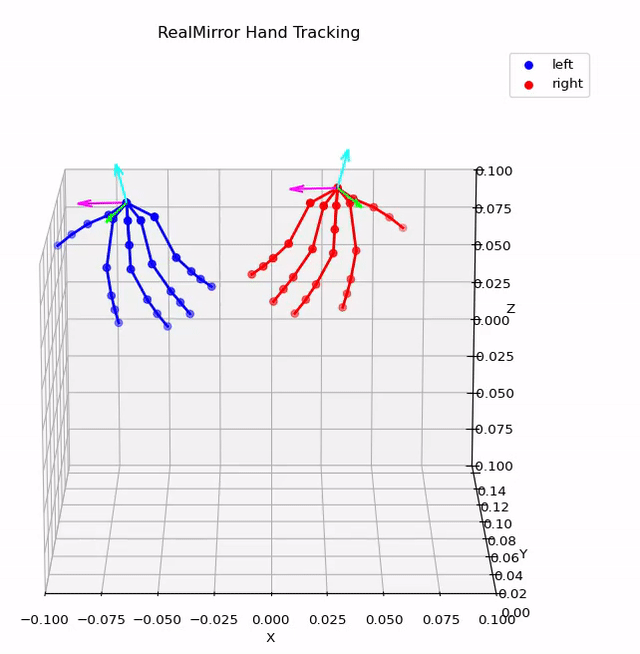
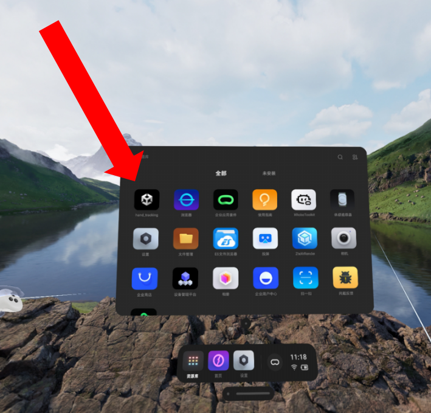
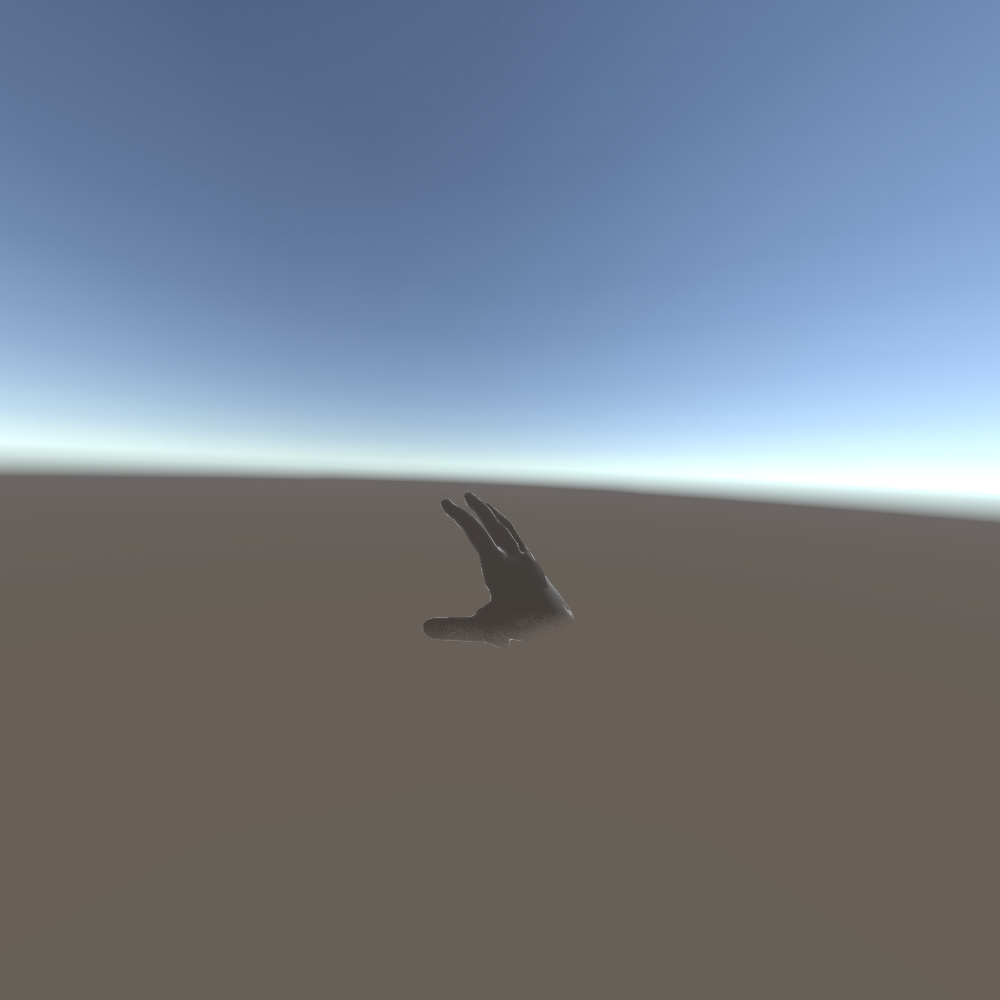

## 1. Install the RealMirror Hand Tracking APK

Download `realmirror_hand_tracking.apk` from the release page:

👉 **[https://github.com/terminators2025/RealMirror-hand-tracking-application](https://github.com/terminators2025/RealMirror-hand-tracking-application)**


<p align="center">
  
</p>

## 2. Configure the Server IP

On the headset, create (do **not** modify an existing file — create a new one) the server config file at:

```
/Android/data/com.PICOcompany.hand_tracking/files/server_config.txt
```

Write your machine's IP address into this file. The UDP port is fixed at `8090`.

## 3. Launch the APK

Open the **hand_tracking** app on the headset. On successful start, raise both hands to confirm the skeletal overlay is visible.
Sideload and install it onto your PICO headset. Once installed, you can find the app on the PICO desktop as shown below:

<p align="center">
  
</p>

After launching the app, raise both hands — you should see a virtual skeletal overlay in the VR view, as shown below:

<p align="center">
  
</p>

## 4. (Optional) Verify the Data Pipeline

Before starting teleoperation, confirm the data is arriving correctly:

```bash
python tools/hand_tracking_visualizer/visualize_hand_tracking.py --port 8090
```

A live 3D skeleton should appear in the Matplotlib window. See [`tools/hand_tracking_visualizer/README.md`](../tools/hand_tracking_visualizer/README.md) for details and troubleshooting.

## 5. Launch Simulation

```bash
$isaac_sim_dir/python.sh script/teleop.py --task Task1_Kitchen_Cleanup --output-dir /data/record \
    --controller-type hand_track --udp-port 8090 --wrist-method rotvec
```

## Keyboard Controls

| Key | Action |
|-----|--------|
| `T` | Toggle right arm teleoperation |
| `G` | Toggle left arm teleoperation |
| `C` | Reset wrist base rotation (recalibrate) |
| `O` / `P` | Arm toggle shortcuts |
| `S` / `R` / `N` | Recording control |

## All Teleoperation Parameters

| ⚙️ Parameter | 📜 Description |
|:------------:|:--------------:|
| `--task` | Name of the task configuration file in the `tasks/` directory (e.g., `Task1_Kitchen_Cleanup`). |
| `--output-dir` | Set data recording output directory. |
| `--disable_recorder` | Disable data recording. |
| `--hide_ik_targets` | Hide the visual target cubes for IK teleoperation. |
| `--controller-type` | Input device: `vr_controller` (default) or `hand_track`. |
| `--udp-port` | UDP port for hand tracking data (default: `8090`, `hand_track` mode only). |
| `--wrist-method` | Wrist orientation method: `rotvec` (default, no gimbal lock) or `euler` (`hand_track` mode only). |
