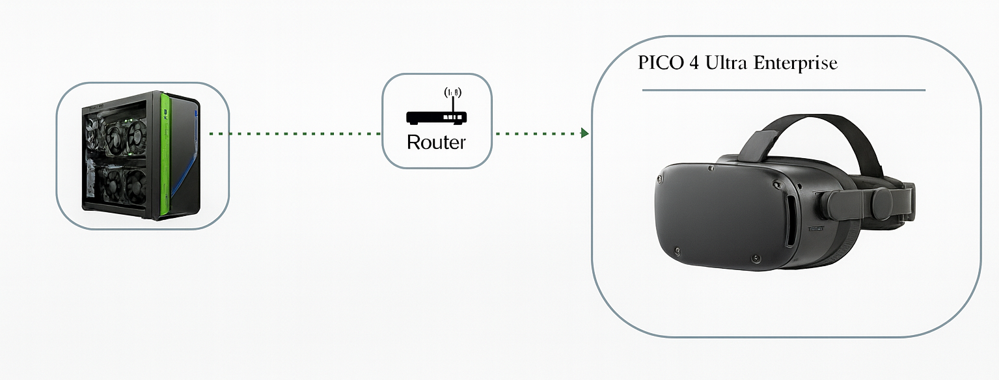
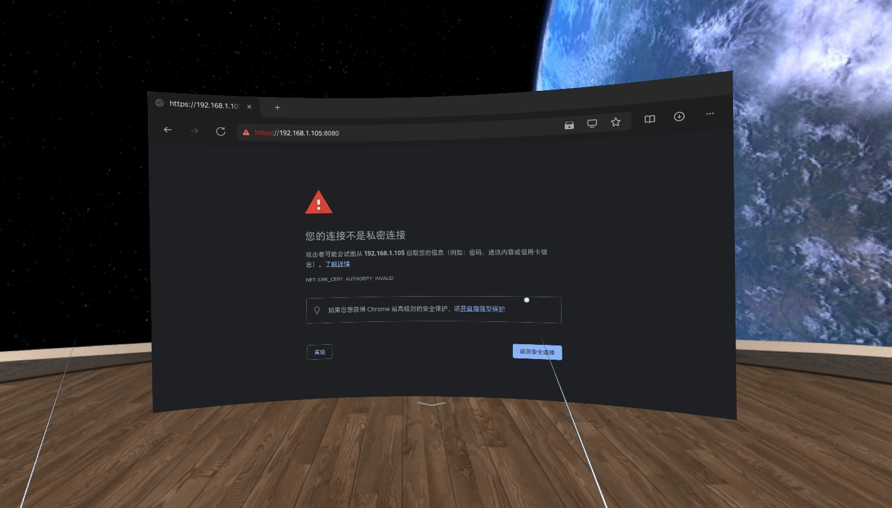
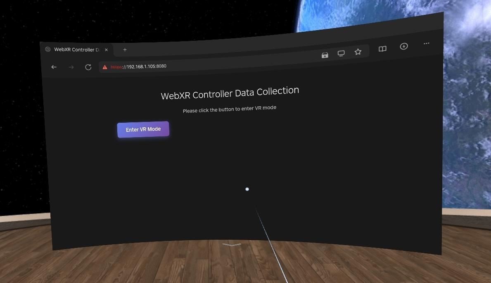
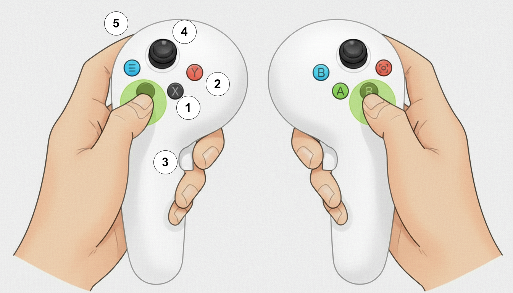

<p align="center">
  <a href="image/WirelessRemote.png">
    
  </a>
</p>

## 1. Install XR-Linker

### 1.1 Install Dependencies
```bash
cd tools/xr_linker
npm install
```

### 1.2 Configure the Server (Optional)
Copy `.env.example` to `.env` and modify as needed:

```bash
cp .env.example .env
```

Edit the `.env` file:

```bash
# Server configuration
PORT=8080
HOST=0.0.0.0

# Logging configuration
LOG_LEVEL=info
LOG_ENABLE_CONSOLE=true
LOG_ENABLE_FILE=true
LOG_DIR=./logs
LOG_MAX_FILES=14d
LOG_MAX_SIZE=20m

# Data storage configuration
DATA_STORAGE_ENABLED=true
DATA_STORAGE_DIR=./data
DATA_STORAGE_MAX_FILES=100

# Socket.IO configuration
SOCKET_CORS_ORIGIN=*
```

### 1.3 Run Server

```bash
npm start
```

## 2. Connect the XR Device
Next steps:

1. Wear your XR headset (e.g. PICO4 etc.)

2. Connect to the corresponding Wi‑Fi

3. Open a browser (e.g. PICO Browser) and go to:  `https://192.168.1.105:8080`

   > **Note 1**: This IP must match your **Wifi** IP (check with `ifconfig`).
   >
   > **Note 2**: You may see a warning page. Click **Advanced**, then **Proceed to IP (unsafe)**.

   <p align="center">
     <a href="image/WarnPrivate.jpg">
       
     </a>
   </p>

4. In the Web XR, click **Enter**. Allow all prompts to start the VR session.

   <p align="center">  <a href="image/WebXRHome.jpg">      </a> </p>

5. You’ll see the terminal prints connection info:
   ```bash
    ========================================
    XR Linker Server Started
    ========================================
    Local Access: https://localhost:8080
    Network Access: https://<YOUR_IP>:8080
    Data File: data/live_pico_data.json
    ========================================
    [2025-**********] info: Client connected {"clientId":"cg5rlqxeZMcqmH7NAAAB","totalClients":1}
   ```

## 3.Controller Button Descriptions

<p align="left">
  
</p>

| No. | Function (Left / Right) |
|---|---|
| ① | Control the corresponding gripper to grab/release|
| ② | Toggle connect/disconnect for right/left arm teleoperation |
| ③ |  Rotate the corresponding wrist roll |
| ④ | Reset the robot to the initial pose and realign IK targets |
| ⑤ |  Rotate the corresponding wrist roll |